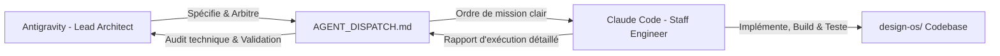

# PROJECT_MEMORY.md — Mémoire Centrale & Journal d'État (Scaffold™)

> **Document de Référence Ultime** : Ce fichier est le journal d'état persistant et la mémoire vivante du projet Scaffold™. Il synthétise l'intégralité des arbitrages, de la genèse fondatrice (58 échanges archivés dans [`TRANSCRIPTION_CONVERSATION_SCAFFOLD.md`](TRANSCRIPTION_CONVERSATION_SCAFFOLD.md)), de l'architecture technique et de l'état opérationnel à la minute près.
> **Règle absolue** : Tout agent IA (Antigravity, Claude Code, Cursor, Codex) débutant une tâche **doit impérativement lire ce document en premier** pour être instantanément synchronisé.

---

## 1. 🎯 Identité, Vision & Raison d'Être

* **Nom de Marque** : **Scaffold™**
* **Définition** : *Visual Workspace & Pre-Code Intelligence Layer for AI Developers*.
* **Slogan Officiel** : *« De l’idée floue au projet structuré. »*
* **Dépôt GitHub Officiel (Plateforme SaaS)** : 🔗 [`https://github.com/Alpha2-far/scaffold-saas`](https://github.com/Alpha2-far/scaffold-saas)
* **Dépôt GitHub Historique (Socle V1 Interne)** : 🔗 [`https://github.com/Alpha2-far/scaffold-v1`](https://github.com/Alpha2-far/scaffold-v1)
* **Licence Officielle** : MIT — Copyright (c) 2026 Scaffold™ (Commit `203a22b`).
* **Le Problème Résolu** : Éliminer la dérive destructive du *vibe coding*. Aujourd'hui, les développeurs confient des invites informelles aux agents de code (Claude Code, Cursor). L'agent commence à coder sans contrat précis, invente des fonctionnalités hors sujet (*feature creep*), corrompt l'architecture de données et produit une dette technique massive.
* **La Solution Scaffold™** : Un SAS de cadrage visuel et déterministe obligatoire **avant toute génération de code applicatif** :
  1. Verrouillage du but premier (*Core Purpose* en 1 à 3 phrases).
  2. Matrice stricte *In-Scope* vs *Out-of-Scope (V1)* (interdiction contractuelle de coder le hors-périmètre).
  3. Modélisation visuelle des entités et relations (*Data Model*).
  4. Maquettage des écrans et des flux UI (*Sections & Screens*).
  5. Audit automatisé déterministe pré-export (`/product-audit`).

### 💎 La Trinité de Valeur Inviolable : Ce que Scaffold™ Vend Réellement

Scaffold™ ne vend pas simplement un fichier de mémoire ou un template d'interface. Il vend une **solution complète et indissociable en 3 piliers** :

1. **Le « Figma des Développeurs » & La Visualisation Immédiate (WYSIWYB)** :
   - Voir directement son projet prendre forme visuellement (Live Canvas interactif, Shell applicatif, maquettage d'écrans en direct) AVANT d'écrire la moindre ligne de code.
   - 43 thèmes d'auteur locaux compilés, 12 tokens sémantiques universels, typographies soignées.
   - **Interdiction d'Errance Externe** : Un développeur ne quitte pas Figma pour chercher sa maquette ailleurs ; de la même façon, l'utilisateur ne quitte jamais Scaffold™ pour chercher des design systems sur le web.
2. **La Structuration Logicielle & Le Cadrage Déterministe** :
   - Transformer une intention humaine ou du vibe coding chaotique en architecture logicielle de niveau industriel.
   - Définition chirurgicale du périmètre (*Ruthless Scoping* : In-Scope V1 vs Out-of-Scope V2+).
   - Modélisation déterministe des données (Data-Shape, entités, relations).
   - 11 décisions exécutives (*recommend-then-confirm*).
   - 5 Stacks d'Auteur certifiées 2026 adaptées logiquement au cas d'usage.
   - Audit santé 100/100 (`product-health.ts`) : zéro incohérence, zéro faille logique avant le passage au code.
3. **La Mémoire Souveraine du Projet & La Continuité Multi-Agents (`milestones.log`)** :
   - Découpage en jalons atomiques digestes pour les LLM (Milestone 1, Milestone 2, ...), chacun apportant une valeur visible et testable à l'écran.
   - Éradication totale du *Context Rot* (agents IA saturés après 20 minutes).
   - Journal universel `milestones.log` : portabilité totale sans lock-in. On commence sur Claude Code, on continue sur Cursor, Codex ou Antigravity sans perdre un seul token ni réexpliquer son projet de zéro.

---

### 🍏 Le Moment Macintosh (1984) & L'Audience Universelle

* **« Vous lui donnez l'idée, Scaffold™ lui donne le jus »** :
  * En 1984, Steve Jobs a démocratisé l'informatique avec le Macintosh : un saut magique où la complexité des lignes de commande s'est effacée pour donner à chacun le super-pouvoir de créer sans être ingénieur.
  * **Scaffold™ est le Macintosh de la création logicielle moderne**. Il n'est **en aucun cas réservé aux seuls développeurs ou agences** :
    1. **Solopreneurs & Créateurs non-techniques** : Matérialisent leur idée en 10 minutes et pilotent des agents de code sans coder.
    2. **Porteurs de Projet & Founders** : Conçoivent, valident et cadrent leur MVP à la vitesse de l'éclair.
    3. **Vibe Coders & Builders IA** : Échappent au chaos des hallucinations et obtiennent une colonne vertébrale architecturale en béton.
    4. **Indie Hackers & Makers** : Expédient des micro-SaaS robustes et monétisables en un temps record.
    5. **Agences & Développeurs Professionnels** : Cadrent les spécifications clients en 30 minutes et suppriment les réunions de cadrage inutiles.
* **Règle d'Or de l'Interaction Humaine (Zéro Jargon Technique)** :
  * L'utilisateur final ne doit **jamais** être confronté au jargon d'ingénierie interne.
  * Les termes *"Brain Dump"*, *"Core Purpose"*, *"In-Scope"*, *"Out-of-Scope"*, *"Data Shape"* sont **strictement bannis du dialogue visible**.
  * L'échange est fluide, naturel et exécutif : l'assistant pose des questions simples et élégantes, et range silencieusement les réponses dans les contrats déterministes sur disque.

---

## 2. ⚡ Tableau de Bord Opérationnel (Live State)

| Indicateur | Statut | Détails |
|---|---|---|
| **Phase Active** | 🚀 **Phase 2 : SaaS Platform — JALON 1 EN COURS** | Socle Serveur Bun & BDD Double Adaptateur (`blueprint/milestones/1-serveur-bun-db/prompt.md`) |
| **Dépôt Officiel SaaS** | 🔗 [`Alpha2-far/scaffold-saas`](https://github.com/Alpha2-far/scaffold-saas) | Branche `main` synchronisée avec GitHub Actions Cloud CI/CD |
| **Invariant Matériel** | 🔒 **Décharge Mac ➔ GitHub Actions** | Zéro build lourd local (`tsc -b`, tests lourds déchargés sur cloud runners) |
| **Arborescence Plan** | 🏛️ **`blueprint/` (ex-_build_plan)** | PRD déterministe + prompts 4 piliers autonomes pour les 7 jalons |
| **Moteur Template HTML** | 💎 **Blueprint HTML Engine** | Standard autonome `docs/reference/blueprint-html-template.md` (WYSIWYB + 1-clic copy) |
| **Prompt Non-Dev** | 🗣️ **Héritage BM PRD Vulgarisé** | Spécifié dans `docs/reference/scaffold-agent-prompt.md` avec injection stacks `/api/stacks` |
| **Dernier Commit GitHub** | [`87e8d83`](https://github.com/Alpha2-far/scaffold-saas/commit/87e8d83) | `docs: track PROJECT_MEMORY.md in scaffold-saas repository` |

---

## 3. 🧩 Synthèse des 3 Briques Fondatrices (Session Fondatrice)

Issu des analyses comparatives de la session fondatrice ([`TRANSCRIPTION_CONVERSATION_SCAFFOLD.md`](TRANSCRIPTION_CONVERSATION_SCAFFOLD.md)) :

| Brique | Rôle Initial | Intégration dans Scaffold™ |
|---|---|---|
| **`bm-skills/bm-prd-creator`** | Moteur de cadrage texte déterministe. | Intégré au cœur de la commande `/product-vision`. Son protocole d'interview structure le PRD et génère la matrice *Out-of-Scope*. Remplacement de `AskUserQuestion` par la règle universelle `ASK`. |
| **`design-os`** | Environnement visuel interactif (React 19 + Vite + Tailwind v4). | Constitue la base de code active de Scaffold V1. Transformé d'un template statique en console de pilotage dynamique dotée de `motion` et d'un audit temps réel. |
| **`agent-os`** | Framework de standards et de règles injectables pour agents IA. | Fournit l'architecture des standards (`/discover-standards`, `/inject-standards`) pour alimenter les agents aval lors de la phase de code. |

---

## 4. 🔄 Les Deux Modes Opérationnels de Scaffold™

Conformément à [`SCAFFOLD_ARCHITECTURE.md`](SCAFFOLD_ARCHITECTURE.md) :

### Mode A : Greenfield (Création Ex Nihilo — Défaut 95% des Créateurs)
L'utilisateur part d'une idée pure. Il est guidé par l'**Agent IA Scaffold natif** (zéro commande slash, posture bienveillante pour non-développeurs inspirée de BM PRD) :
1. **Intake conversationnel & Vision** : Reformulation exécutive et synthèse de mission.
2. **Ruthless Scoping** : Verrouillage strict *In-Scope V1* vs *Out-of-Scope (Cut List)*.
3. **Moteur de Stacks d'Auteur Vulgarisé** : Recommandation motivée en langage clair parmi les stacks modernes :
   - *SaaS Standard (Supabase First)* : Auth Google + BDD PostgreSQL managée + Fichiers.
   - *Serverless Modern (Neon Postgres)* : BDD serverless avec branching instantané.
   - *Hyper-Speed Backend (Bun)* : Démarrage en 5 ms et streaming SSE natif.
   - *Edge-First Global (Cloudflare D1 & Workers)* : Latence < 10 ms et coûts quasi nuls.
   - *Mobile & PWA First (Expo / React 19 PWA)* : Application cross-platform iOS & Android.
   - *AI & Data Intensive (FastAPI + pgvector)* : Recherche sémantique et pipelines IA.
   - *Custom Dérivé (Zod-validé)* : Pour toute autre stack spécifique.
4. **Data Shape & Entités** : Déduction logique des entités manipulées (`data-shape.md`).
5. **Visual Studio WYSIWYB** : Choix parmi les 43 thèmes d'auteur locaux et prévisualisation directe sur le Live Canvas.
6. **Milestones Engine & Audit** : Découpage en jalons atomiques, score santé 100/100, et génération du `milestones.log` client.
7. **Exportation Déterministe** : Déverrouillage de `product-plan.zip` prêt pour Claude Code / Cursor.

### Mode B : Brownfield (Codebase Existante — Pont Zéro-Install Scaffold × Agent OS)
Scaffold SaaS est 100% Web sans accès disque. Pour un projet existant :
1. L'interface web génère un **Prompt d'Extraction Universel**.
2. Le client colle ce prompt dans son agent local (Claude Code, Cursor), qui scanne le dépôt et produit un JSON standardisé (`scaffold-intake.json`).
3. Scaffold ingère ce JSON, verrouille l'existant (*Scope Lock*) et cadre la prochaine fonctionnalité sans régressions.

---

## 5. 🎨 Charte Graphique & Standards Design Officiels

Arrêtés et formalisés lors des échanges 55 à 58 de la session fondatrice :
* **Emblème & Logo** : 4 barres horizontales aux extrémités arrondies et décalées selon une géométrie précise, animées par GPU dans [`src/components/ScaffoldLogoLoader.tsx`](design-os/src/components/ScaffoldLogoLoader.tsx).
* **Palette Officielle (Midnight Navy & Neon Green)** :
  * `--color-scaffold-navy` : `#01062B` (Fond sombre luxe officiel, éradication définitive du marron-gris `stone-900`).
  * `--color-scaffold-navy-deep` : `#020826`.
  * `--color-scaffold-green` : `#22C55E` (Vert électrique vibrant — accent principal).
  * `--color-scaffold-lime` : `#84CC16` (Lime éclatant — point haut du dégradé).
  * `--color-scaffold-emerald` : `#064E3B` (Émeraude profond — point bas du dégradé).
* **Zéro « Sticker Noir »** : Header en verre dépoli ultra-pur (`backdrop-blur-xl`), logos avec canal Alpha 100% transparents (`scaffold-logo-dark.png` et `scaffold-logo-light.png`).
* **Animations Contrôlées** : Utilisation stricte de `<LazyMotion strict>` (`motion@13.2.0`) avec feature bundle `domAnimation` pour un surcoût bundle de seulement +57 kB, respectant scrupuleusement `useReducedMotion()`.

---

## 6. 👥 Protocole Multi-Agents (Antigravity & Claude Code)

* **Antigravity (Google)** :
  * **Rôle** : *Lead Architect & Product Shaper*.
  * **Responsabilités** : Rédige les spécifications, conçoit l'architecture système, supervise l'UI/UX, prépare les ordres de mission dans [`AGENT_DISPATCH.md`](AGENT_DISPATCH.md) et valide les jalons.
  * **Fichier de directive** : [`GEMINI.md`](GEMINI.md).
* **Claude Code (Anthropic)** :
  * **Rôle** : *Staff Engineer d'Exécution*.
  * **Responsabilités** : Lit `AGENT_DISPATCH.md`, manipule le code source dans `design-os/`, exécute les commandes bash (`npm`, `vite`, `git`), garantit le build à 0 erreur et rédige son rapport d'exécution.
  * **Fichier de directive** : [`CLAUDE.md`](CLAUDE.md).

---

## 7. 📜 Historique Exhaustif des Jalons Validés

### 🟢 Jalon 1 : Intégration du Moteur BM PRD dans `/product-vision`
* **Problème d'origine** : `/product-vision` posait 3 questions vagues sans verrouiller le scope. BM PRD était puissant mais enfermé dans `AskUserQuestion`.
* **Réalisé** : Règle universelle `ASK` (fin du vendor lock-in). Double sortie déterministe vers l'UI Design OS et vers `product/prd.md`.
* **Statut** : ✅ Validé avec félicitations.

### 🟢 Jalon 2 : Verrouillage du Périmètre & Guard à l'Export
* **Problème d'origine** : Risque que le hors-scope soit ignoré par les commandes de retouche ou lors de l'exportation.
* **Réalisé** : *PRD Sync Guard* dans `/product-roadmap` et `/data-shape`. Exportation automatique de `## Out of Scope (V1)` dans `product-plan/` et injection dans les prompts des agents de code.
* **Statut** : ✅ Validé.

### 🟢 Jalon 3 : Moteur d'Audit Déterministe (`/product-audit`)
* **Problème d'origine** : Absence de moyen fiable de vérifier la cohérence d'un produit avant de le faire coder.
* **Réalisé** : Commande `/product-audit` (alias `/scaffold-audit`) scannant 4 contrats mathématiques (Scope Lock, Regex Design OS, Couverture des features, Étanchéité des sections).
* **Statut** : ✅ Validé.

### 🟢 Jalon 4 : UI Dynamique Motion, Console d'Audit en Direct & Branding
* **Problème d'origine** : Landing page figée et déconnectée de l'audit. Dark mode marronnasse avec sticker noir sur le logo.
* **Réalisé** : Architecture `LazyMotion strict` (`motion@13.2.0`), console de bord en direct (`StatusConsole.tsx` + `product-health.ts`), logo officiel Scaffold™ sans fond parasite, dark mode Midnight Navy. Poussé sur GitHub (`24c0173` & `203a22b`).
* **Statut** : ✅ Validé & Poussé.

### 🟢 Jalon 4.1 (Achevé & Synchronisé) : Mini-Charte, Animated Logo Loader & Réalignement Agent OS
* **Réalisé** :
  * Création du composant SVG animé [`ScaffoldLogoLoader.tsx`](design-os/src/components/ScaffoldLogoLoader.tsx) avec pulsation et vague néon GPU des 4 barres.
  * Intégration des variables CSS de la charte officielle (Midnight Navy `#01062B`, vert électrique `#22C55E`, lime `#84CC16`).
  * **Mise à jour complète des standards Agent OS** dans [`design-os/agent-os/standards/`](design-os/agent-os/standards/) :
    * `css/motion.md` : aligné sur `LazyMotion strict`, `motion/react-m` et les motion tokens.
    * `css/color-vocabulary.md` : aligné sur la mini-charte officielle Scaffold.
    * `global/scope-lock.md` : nouveau standard pour la règle universelle `ASK`, la double sortie BM PRD et le PRD Sync Guard.
    * `javascript/product-audit.md` : nouveau standard pour le moteur d'audit déterministe (terminal et navigateur).
    * `javascript/markdown-parsing.md` : mis à jour avec les contrats de parsing du Scope Lock.
    * `index.yml` : réindexation complète des 17 standards.
  * Build 100% vert (`tsc -b && vite build` ➔ 2153 modules, 0 erreur).
* **Statut** : ✅ Prêt pour commit et push final V1.

### 🟡 Jalon 5 (Code terminé, revue en attente) : Moteur de Thèmes Propriétaire & Ingestion designmd.ai
* **Problème d'origine** : Le design system initial utilisait une palette Cyan/Amber générique, la route vivait derrière `/admin`, et l'utilisateur risquait de devoir sortir de Scaffold pour trouver un système visuel — violation directe de l'invariant « Figma des Développeurs ».
* **Réalisé** :
  * **43 templates ingérés** depuis designmd.ai via le serveur MCP `designmd`, puis **compilés localement** par [`design-os/scripts/compile-presets.mjs`](design-os/scripts/compile-presets.mjs) (`npm run presets`). **Zéro appel réseau à l'exécution** — l'invariant d'errance externe est tenu structurellement.
  * **5 palettes d'auteur Scaffold** (Titanium, Hyper Indigo, Emerald Cyber, Amber Solar, Rose Quartz) remplaçant le modèle hérité, chacune dérivée en OKLCH et mesurée, dans [`bm-skills/skills/bm-design-system/references/derive-palette.md`](bm-skills/skills/bm-design-system/references/derive-palette.md).
  * **Nouveau token `--color-on-accent`** : `.btn-primary` était `bg-accent text-page`, ce qui supposait un accent sombre. Le vert de charte `#22c55e` sous texte blanc mesure **2,28:1**. 11 des 43 thèmes ont un accent clair et auraient produit des boutons illisibles.
  * **Loi de contraste AAA appliquée par le compilateur** : 38 encres de kits remontées à 7:1 le long de leur propre teinte, hiérarchie `display > body > muted` assertée, et échec de compilation si un invariant est violé.
  * **Theme Studio** ([`design-os/src/components/ThemeStudio.tsx`](design-os/src/components/ThemeStudio.tsx)) sur `/design` : galerie filtrable, bascule Light/Dark et Visual/Raw. Preview scopée sous `[data-scaffold-preset]` — un thème produit ne peut structurellement pas contaminer le chrome de Scaffold.
  * **`/admin` définitivement éradiqué** (18 occurrences). La route est `/design`, fixée et non négociée.
  * **Export hermétique** : `product-plan/DESIGN.md` verbatim + `tokens.css` dérivé des hex mesurés + primitives portables dans `design-system/components-ui/`.
* **Point de vigilance** : catalogue de **43 kits curatés**, pas l'intégralité de designmd.ai (bibliothèque > 1000 kits, API plafonnée à 20 résultats/requête avec rate-limit). Pipeline générique — élargir le catalogue est une décision produit ouverte.
* **Statut** : ✅ Validé avec félicitations par Antigravity le 2026-09-16.

### 🟢 Phase 5.7 (Achevée) : Audit Context7, Migration React 19 & Graphe Graphify
* React 19 : 24 `forwardRef` dépréciés convertis en props directes. `cachedLazy` créé pour stabiliser les previews dynamiques.
* Tailwind v4 : `flex-shrink-0` ➔ `shrink-0`, `outline-none` ➔ `outline-hidden` (accessibilité forced-colors).
* Graphe Graphify : 411 nœuds et 943 liaisons intégrés dans `.graphify/`, script `"graphify": "graphify update . --scope all"`.
* Linting : **0 erreur, 0 warning** (baseline de 9 erreurs purgé).
* **Statut** : ✅ Commité sous `73a8e9c` et poussé sur GitHub.

### 🟢 Phase 5.8 (Achevée) : Entretien Exécutif Naturel (§0.6 Pare-Feu de Vocabulaire)
* Éradication totale du jargon robotique (*"Core purpose"*, *"Brain dump"*, *"In-scope"*, *"Cut list"*, *"Data shape"*) du dialogue visible avec le client.
* Préservation absolue des contrats de fichiers machine sur disque (`## Key Features`, `## Out of Scope (V1)`, `## Entities`).
* Standard officiel gravé dans `agent-os/standards/global/executive-register.md`.
* **Statut** : ✅ 12/12 vérifications validées, commité et poussé sur GitHub (`73a8e9c`).

---

## 8. 🗺️ Cartographie Complète du Workspace `FAREL OS`

* 📁 [`design-os/`](design-os/) : **Codebase de Scaffold V1 (Projet 1 interne validé et poussé sur GitHub `Alpha2-far/scaffold-v1`)**.
* 📁 [`docs/`](docs/) : **Arborescence documentaire officielle de la Plateforme SaaS Scaffold™ (Méthode Instatic)**.
  * [`docs/README.md`](docs/README.md) : Index central et table des sources de vérité.
  * [`docs/CONVENTIONS.md`](docs/CONVENTIONS.md) : Règles de rédaction IA (< 600 lignes, ancrage chemins, zéro marketing).
  * [`docs/architecture.md`](docs/architecture.md) : Vue système de la plateforme SaaS.
  * [`docs/features/scaffold-agent.md`](docs/features/scaffold-agent.md) : L'Agent IA natif (zéro commande slash).
  * [`docs/features/export-engine.md`](docs/features/export-engine.md) : Compilateur du package `product-plan/`.
* 📄 [`METHODOLOGIE_DOCUMENTAIRE_INSTATIC.md`](METHODOLOGIE_DOCUMENTAIRE_INSTATIC.md) : **La bible méthodologique Instatic** (règles dures, squelette canonique, table des sources de vérité, gate tests).
* 📁 [`Scaffold/`](Scaffold/) : Assets visuels officiels (logos détourés HD, mini-charte graphique).
* 📁 [`skills/`](skills/) & 📄 [`SKILLS_CATALOG.md`](SKILLS_CATALOG.md) : Catalogue des 292 skills d'ingénierie.
* 📁 [`bm-skills/`](bm-skills/) : Moteur original BM PRD Creator (référence des 11 questions).
* 📁 [`Instatic/`](Instatic/) : Dépôt officiel Instatic servant de référence d'ingénierie documentaire.
* 📄 [`TRANSCRIPTION_CONVERSATION_SCAFFOLD.md`](TRANSCRIPTION_CONVERSATION_SCAFFOLD.md) : Transcription intégrale des 58 échanges fondateurs.
* 📄 [`TRANSCRIPTION_SESSION_DESIGN_SYSTEM.md`](TRANSCRIPTION_SESSION_DESIGN_SYSTEM.md) : Transcription de la session design system & 43 thèmes.

---

## 9. 🏛️ La Stratégie Double Usage : Instatic Docs pour Scaffold V1 & Export V2

1. **Usage V1 (Immédiat — Conception de la Plateforme SaaS)** :
   * Nous utilisons la méthodologie documentaire d'Instatic pour concevoir et documenter la **Plateforme SaaS Scaffold™**.
   * **Invariant d'usage pour le client final** : **Zéro commande slash** (`/product-vision`, `/export-product`). L'utilisateur dialogue naturellement avec l'Agent IA Scaffold au centre de l'interface web.
   * **Livrable pour le client V1** : La plateforme exporte le package hermétique **`product-plan/`** (Scaffold V1).
2. **Usage V2 (Futur — Export d'Armure Instatic pour les Clients)** :
   * Lorsque Scaffold V2 introduira l'export de l'arbre documentaire complet `docs/` d'Instatic pour les projets créés par les utilisateurs, **toute la structure, les conventions et les gabarits sont déjà consignés dans `METHODOLOGIE_DOCUMENTAIRE_INSTATIC.md`**, sans nécessiter de reconception.

---

## 10. 🚀 Phase 6 (Achevée) : Architecture Complète de la Plateforme SaaS (16 Septembre 2026)

* **Purge Historique Git 100%** : Les 30 commits du dépôt ont été réécrits avec `Farel Viaho <Kitsonfarel@gmail.com>` comme auteur et committer unique. 100% propriétaire, remote upstream supprimé et force push réussi sur GitHub.
* **Product OS (`docs/product.md`)** : Définition canonique de Scaffold™ comme produit (problème, cible, principes WYSIWYB, Greenfield V1 vs exclusions strictes, cycle de vie du projet).
* **Ergonomie Responsive & Interface (`docs/interface.md`)** : Rail d'icônes 56 px escamotable pour écrans 13"-14", asymétrie 40/60 préservée et flux SSE On-Demand dans le dashboard Superadmin `/admin`.
* **Design System Officiel (`docs/design.md`)** : Palette Midnight Navy / Vert Électrique, 12 tokens sémantiques OKLCH, 43 presets locaux, haptique et animations.
* **Backend Serveur Bun & Double DB (`docs/server.md`)** : `Bun.serve`, client `DbClient` unifié (Postgres prod / SQLite local), schéma SQL complet, streaming SSE.
* **Sécurité Défensive Anti-Bot (`docs/features/security-anti-bot.md`)** : Cloudflare Turnstile, Honeypot invisible, rate limiting glissant (auth & LLM chat), bannissement IP automatique (1h/24h) et console de sécurité.
* **Passerelle OpenRouter & Sync Dynamique (`docs/features/openrouter-model-sync.md`)** : Cascade native `models: [...]` (Claude 3.7 ➔ GPT-4o ➔ Gemini 2.0 ➔ DeepSeek R1), tolérance aux pannes maximale, et réordonnancement à chaud depuis `/admin/models`.
* **Orchestration Agentique (`docs/features/agent-runtime.md`)** : Contrat formel d'exécution, hydratation de session, mutations d'état Zod, idempotence et reprise après coupure.
* **Compilateur Déterministe (`docs/features/compilation-engine.md`) & Catalogue (`docs/reference/capability-catalog.md`)** : Étude de cas exhaustive Google Auth (`auth.google`) répercutée dans les 6 fichiers de `product-plan/`.
* **Le Standard `soul.md` (`docs/features/soul.md`)** : L'âme de l'Agent Scaffold (ton, priorités, limites, manière de trancher) et le modèle de `product/soul.md` pour le projet client.
* **Monétisation & Billing (`docs/features/billing.md`)** : Tiers Free/Pro, quotas projets/exports, abstraction totale des tokens LLM, webhooks Stripe idempotents.
* **Jobs Asynchrones (`docs/features/jobs.md`)** : Machine d'état (`queued` ➔ `running` ➔ `completed` / `failed`) pour compilation, exports ZIP et audits lourds.
* **Garde-Fous d'Architecture (`docs/reference/architecture-tests.md`)** : Suite de tests automatisés Instatic bloquant toute régression ou fuite de secret.
* **Engineering Knowledge Base (`knowledge/SCAFFOLD_ENGINEERING_KB.md`)** : Les 6 règles de sécurité 2026, matrices de trade-offs et noeuds vitaux.
* **Compétence Agent Portable (`scaffold-agent/`)** : Implémentation modulaire et portable respectant les 17 règles canoniques de `bm-skill-builder`.

---

## 11. 🌟 Révolution du Moteur de Stacks & des Milestones Client (17 Septembre 2026)

* **Paradigme 100% Web SaaS (Zéro Accès Disque)** :
  - Scaffold s'exécute dans le cloud et dans le navigateur ; il n'a aucun accès physique au disque dur local du client.
  - L'intake est **Greenfield par défaut** (95% des créateurs).
  - Pour les projets existants (**Brownfield**), l'intake est 100% web : déclaration conversationnelle dans le chat ou glisser-déposer de `package.json` / schéma dans la console web.
* **Moteur d'Architectures d'Auteur Scaffold (Éradication du Biais Rails 8)** :
  - Remplacement de l'ancien template rigide hérité par **5 Architectures d'Auteur Déterministes 2026** :
    1. `saas.standard` (React 19 + TypeScript + Tailwind v4 + PostgreSQL / Supabase) — Recommandé par défaut.
    2. `hyper.speed` (Bun runtime + React 19 + SQLite local / Postgres prod + SSE natif).
    3. `mobile.first` (React 19 / Vite PWA ou Expo + Supabase).
    4. `ai.data` (Python FastAPI + Vector DB + React 19).
    5. `custom.derived` (Spécification libre validée par schéma Zod).
* **Révolution des Milestones Client (`milestones.log` exporté)** :
  - Exactement comme le Design System a été révolutionné pour être propriétaire et certifié AAA :
  - Les milestones du projet client ne sont plus des invites de texte libres floues.
  - Chaque jalon livre obligatoirement une interface **visible et testable dans le navigateur**.
  - L'archive `product-plan.zip` exporte un **`milestones.log` pré-configuré pour le client**, permettant à Claude Code ou Cursor d'exécuter chaque jalon avec ses critères de validation sans dériver.

---

## 12. 🍏 Doctrine Steve Jobs (1984) : « L'Appareil Doit Parler » & Moteur UI Déterministe (18 Septembre 2026)

* **Le Problème Résolu** : Élimination définitive des bogues de compilation à chaud (Vite HMR cassé, imports hallucines) et des chevauchements de texte constatés sur le prototype initial.
* **Invariant Inviolable : « L'Appareil Doit Parler »** :
  - En 1984, Steve Jobs a exigé que le Macintosh parle à la seconde 1. Les ingénieurs n'ont pas pris le risque d'un calcul instable sur scène : les phonèmes étaient pré-compilés en mémoire vive (`MacinTalk`).
  - **Scaffold™ applique cette même rigueur absolue** :
    1. **Étage 1 (Live Canvas — 100% Contrôlé & Zéro Compilation)** :
       - Le Live Canvas **ne compile aucun fichier TSX à la volée**.
       - L'Agent émet un **AST JSON validé par Zod (`UIManifest`)**.
       - Ce schéma est directement projeté dans un **Registre de Primitives Pré-Compilées** (`AppShell`, `MetricGrid`, `DataTable`, `HeroHeader`, `FormDrawer`) chargées en mémoire.
       - **0% d'erreur de compilation**, **0% de collision de texte** (slots CSS Grid `minmax(0, 1fr)` étanches), rendu fluide à **60 FPS (< 16 ms)**.
    2. **Étage 2 (Export Compiler — Synthétiseur Statique React 19)** :
       - Lorsque le client clique sur "Exporter pour Claude Code / Cursor", le compilateur synthétise de **vrais composants React 19 propres, typés et modulaires**.
       - Le code exporté respecte scrupuleusement Tailwind v4, les 12 tokens du thème et les 4 contrats d'audit (Score 100/100).
* **Document de Référence** : [`docs/features/deterministic-ui-engine.md`](docs/features/deterministic-ui-engine.md).

