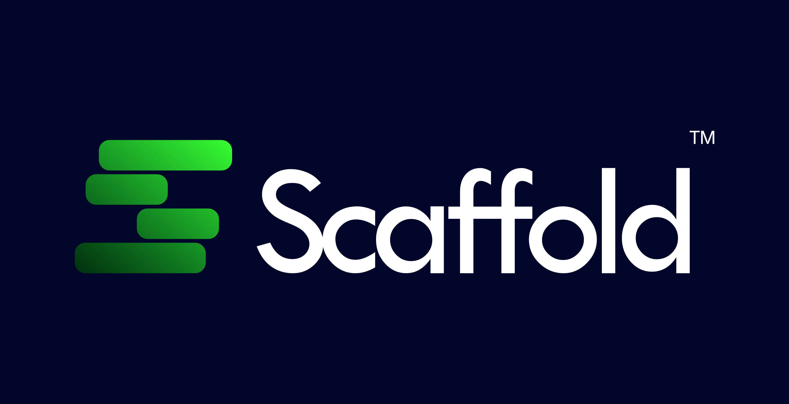

<p align="center">
  <picture>
    <source media="(prefers-color-scheme: dark)" srcset="./assets/logo-scaffold-couleur-fond-noir.png">
    <source media="(prefers-color-scheme: light)" srcset="./assets/logo-scaffold-couleur-fond-transparent.png">
    
  </picture>
</p>

<p align="center">
  <strong>The Visual Workspace & Pre-Code Intelligence Layer for AI Developers.</strong><br>
  <em>Transform human intent into deterministic visual specifications, locked scope, and production-ready handoff before writing backend code.</em>
</p>

<p align="center">
  
  
  
  
  
</p>

---

## ⚡ The Problem: The "Vibe Coding" Paradox

AI coding agents (Claude Code, Cursor, Codex, Antigravity) are faster than ever. Yet most projects fail or stall after a few prompts:
* **Scope Creep by Default** : Agents invent unneeded features (auth, social shares, multi-tenancy) because boundaries are never formally locked.
* **Code-First Blindness** : Agents write database schemas and API controllers without any visual consensus on what "done" actually looks like in a browser.
* **Fragile Prompts** : An informal chat prompt is not a specification. When the agent loses context or deviates, repairing the code takes longer than writing it from scratch.

**Scaffold™** solves this paradox by introducing the **Pre-Code Intelligence Layer**. You design, specify, and lock your product *visually* first — then hand off deterministic, scope-bounded instructions to your coding agents.

---

## 🚀 Core Features (Scaffold™ V1)

```text
┌────────────────────────────────────────────────────────────────────────┐
│                              SCAFFOLD™                                 │
├────────────────────────────────┬───────────────────────────────────────┤
│    1. Discovery & Scope Lock   │  • Universal BM PRD Engine            │
│       (/product-vision)        │  • Strict V1 vs Out-of-Scope Matrix   │
├────────────────────────────────┼───────────────────────────────────────┤
│    2. Data & Navigation        │  • Conceptual Relational Data Shape   │
│       (/data-shape, /roadmap)  │  • Roadmap & Screen Sections          │
├────────────────────────────────┼───────────────────────────────────────┤
│    3. Interactive UI Canvas    │  • Real React 19 + Tailwind v4        │
│       (/shape-section, /design)│  • Component Mock Data & Shells       │
├────────────────────────────────┼───────────────────────────────────────┤
│    4. Deterministic Pre-Audit  │  • Multi-file Scope-Lock Verification │
│       (/scaffold-audit)        │  • Zero-leakage gate before export    │
├────────────────────────────────┼───────────────────────────────────────┤
│    5. Production Agent Handoff │  • PRD + Out-of-Scope Prompts         │
│       (/export-product)        │  • Packaged for Claude, Cursor, Codex │
└────────────────────────────────┴───────────────────────────────────────┘
```

### 1. 🎯 Universal Product Discovery (`/product-vision` · `/bm-prd`)
* Replaces vague brainstorming with a structured 8-phase discovery protocol.
* **Adaptive Interrogation (`ASK`)** : Works natively in Claude Code (`AskUserQuestion`), Antigravity (`ask_question`), or plain CLI (numbered menus) without vendor lock-in.
* **Strict Out-of-Scope Matrix** : Explicitly categorizes every rejected feature (`V2`, `Later`, `Never`) so coding agents cannot quietly expand scope.

### 2. 🧱 Relational Data Shape (`/data-shape`)
* Establishes a shared entity vocabulary before UI components or database migrations are written.
* Synchronized in real time with the product requirements document (`product/prd.md`).

### 3. 🎨 Interactive React 19 Canvas (`/shape-section` · `/design-screen`)
* Generates live, renderable React components styled with Tailwind CSS v4 and Radix UI.
* Test states, edge cases, and empty states directly in the browser with sample data.

### 4. 🔍 Deterministic Pre-Export Audit (`/scaffold-audit` · `/product-audit`)
* A read-only verification engine that scans your specification across 4 rigorous checks:
  1. **Scope Lock Coherence** : Strict equality between PRD source and overview mirrors.
  2. **Parser Contract Conformance** : Validates all markdown regex contracts before build.
  3. **Feature Coverage Map** : Ensures zero orphan features across roadmap sections.
  4. **Section Boundary Enforcement** : Flags any out-of-scope leak before export.

### 5. 📦 Bulletproof Agent Handoff (`/export-product`)
* Compiles your visual workspace into `product-plan/` with:
  * Full `prd.md` embedded verbatim.
  * `## Out of Scope (V1)` guardrails injected directly into agent prompt templates (`one-shot-prompt.md`, `section-prompt.md`).
  * Ready for immediate consumption by Claude Code, Cursor, or Codex.

---

## 🛠️ Quick Start

### Prerequisites
* Node.js 20+
* npm

### Installation & Launch

```bash
# Clone the repository
git clone https://github.com/Alpha2-far/scaffold-v1.git
cd scaffold-v1

# Install dependencies
npm install

# Start the local visual workspace
npm run dev
```

Open [http://localhost:5173](http://localhost:5173) to explore your visual workspace.

---

## 🎮 Workflow & Slash Commands

When working with an AI coding agent inside Scaffold, use the following command sequence:

| Step | Command | Description |
|---|---|---|
| **1. Vision** | `/product-vision` (ou `/bm-prd`) | Intake, core purpose, in-scope features, and strict out-of-scope matrix |
| **2. Data** | `/data-shape` | Define core entities, plain-language attributes, and relationships |
| **3. Roadmap** | `/product-roadmap` | Sequence 3–5 navigable sections with feature coverage map |
| **4. Tokens** | `/design-tokens` | Select colors, typography, and visual identity tokens |
| **5. Shell** | `/design-shell` | Configure main navigation, header, and application layout |
| **6. Sections** | `/shape-section` | Detail user flows, component requirements, and sample data |
| **7. Screens** | `/design-screen` | Generate real React 19 screen designs on the canvas |
| **8. Audit** | `/scaffold-audit` (ou `/product-audit`) | Automated pre-export compliance check |
| **9. Export** | `/export-product` | Package verified UI-specs and prompt instructions into `product-plan/` |

---

## 🏗️ Technical Stack

* **Frontend Runtime** : React 19, TypeScript, Vite
* **Styling System** : Tailwind CSS v4, Radix UI Primitives, Lucide Icons
* **Quality & Build** : ESLint, TypeScript Strict Mode, GitHub Actions CI

---

## 📄 License

Distributed under the MIT License. See `LICENSE` for more information.

---

<p align="center">
  <strong>Scaffold™</strong> — Built with discipline for the next generation of AI software engineering.
</p>
